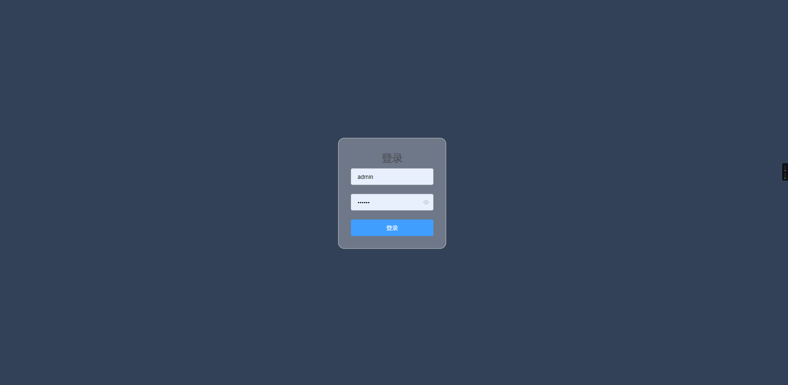
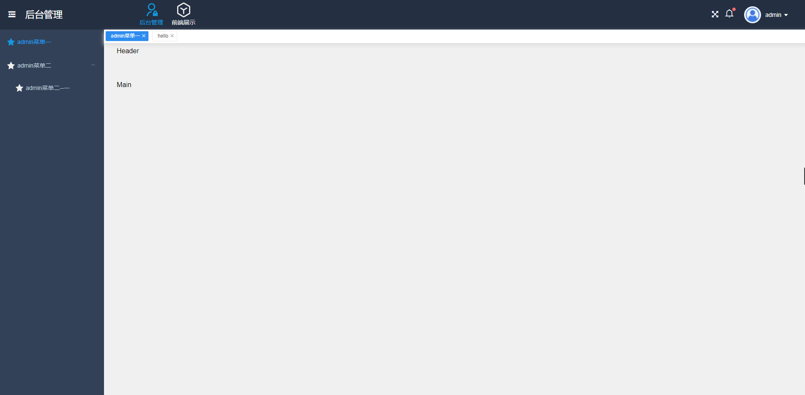
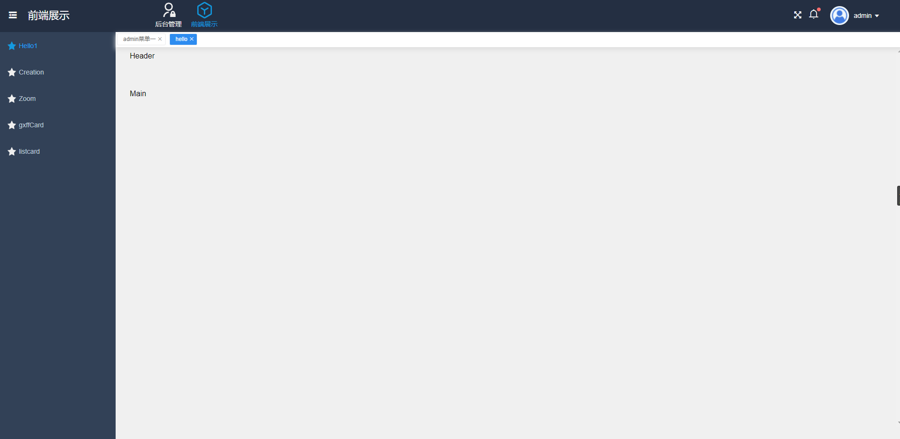

# vue-manage
此项目一套基于`vue2` + `element-ui`构建的允许添加多个单独子系统的管理框架。所有子系统拥有独自的`layout`，`router`和`store`信息，系统会在进入子系统时自动根据`router`生成菜单，并在进入系统时向系统中添加子系统的`store`数据。

## 说明
系统中的数据暂时通过`mock`生成。
# 技术栈
`vue2` `vuex` `vue-router` `webpack` `scss` `element-ui`

# 项目运行
```js
git clone https://github.com/li1615882553/vue-manager.git

cd vue-manage  

npm install 

npm start

访问: http://localhost:8080
```

# 部分截图



